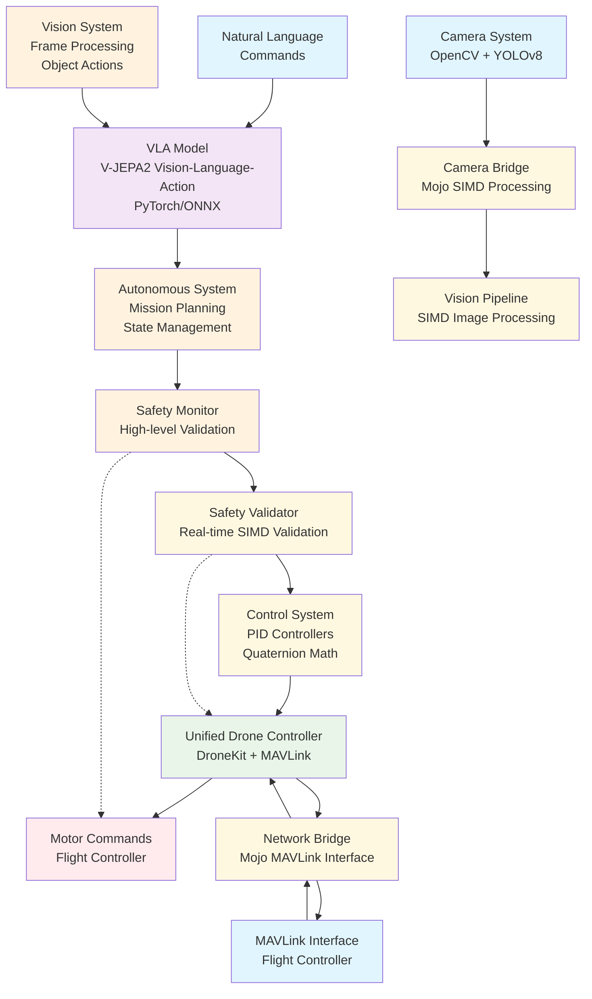
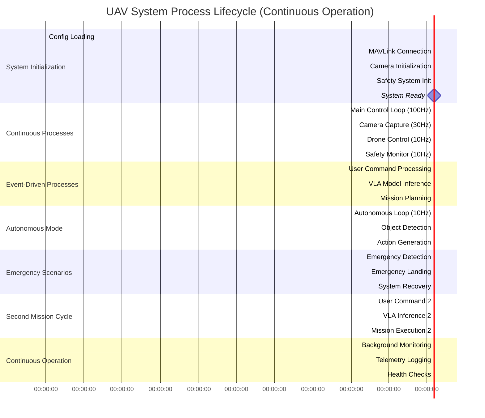
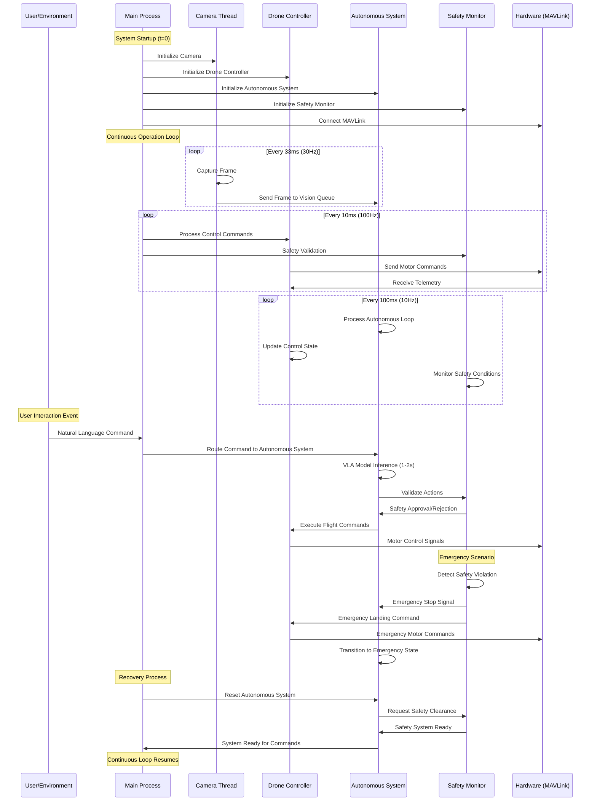

# IAV: Intelligent Aerial Vehicle

## Project Goals 

### Functionality-related goals:

- **State-of-the-art AI capabilities:** World modeling, natural language understanding, ability to reason and plan
- **Robust and flexible multimodel data processing:** Video / image data through camera(s), Audio data through microphone, LIDAR, etc.
- **Blazingly fast inference and communication with sensors and actuators:** production-ready ai product, not a research toy or proof of concept
- **Lightweight and scalable hardware needs:** Ability to be mass produced and inexpensive for consumer usage
- **Robust system programming:** Fault tolerance and resilience, data consistency and integrity, high availability and responsiveness

### Internal development-related goals:

- **Streamlined development and deployment cycle:** package / environment management, automated workflows, version control, pre / post training pipelines, unit / integration testing, containerization and deployment
- **Flexible, modular, extensible APIs**
- **Ability to iterate, prototype, and test quickly**
- **Precise and correct program specifications:** 

### System Components Flowchart



### Process Lifetime Diagram



### Process Interaction Timeline



### Core Components

- **Mojo Core**: Performance-critical flight control, safety monitoring, and VLA inference
- **Python Interface**: Hardware I/O, MAVLink communication, and vision capture
- **Safety System**: Real-time constraint validation and emergency procedures
- **Control Allocator**: 6DOF action mapping to motor commands


##  Quick Start

```bash
# Activate pixi environment
source activate-pixi.sh

# Build and validate
pixi run build

# Run tests
pixi run test

# Start development (simulation mode)
pixi run dev
```

### Basic Flight

```bash
# Start with default configuration
pixi run python main.py

# Use simulation mode  
pixi run python main.py --simulation

# Execute single command
python main.py --command "takeoff to 5 meters"

# Custom configuration
python main.py --config config/custom_config.json
```

### Configuration

Edit `config/minimal_config.json`:

```json
{
  "mavlink": {
    "connection": "/dev/ttyUSB0"
  },
  "camera_id": 0,
  "control_frequency": 100
}
```

### Simulation

For SITL testing:

```bash
# Start SITL simulator first
python main.py --simulation
```

### Setup & Installation

```bash
# Prerequisites: Install pixi
curl -fsSL https://pixi.sh/install.sh | bash

# Clone and setup
git clone <repository-url>
cd drone-vla

# Install unified environment
pixi install

# Activate environment (optional)
source activate-pixi.sh
```

### Building

```bash
# Build and validate all components
pixi run build

# Run comprehensive tests
pixi run test

# Development workflow
pixi run dev
```

### Testing

```bash
# Run full test suite
pixi run test

# Or run pytest directly in pixi environment
pixi run python -m pytest tests/ -v

# Test specific component
pixi run python -m pytest tests/test_minimal_interface.py -v
```

